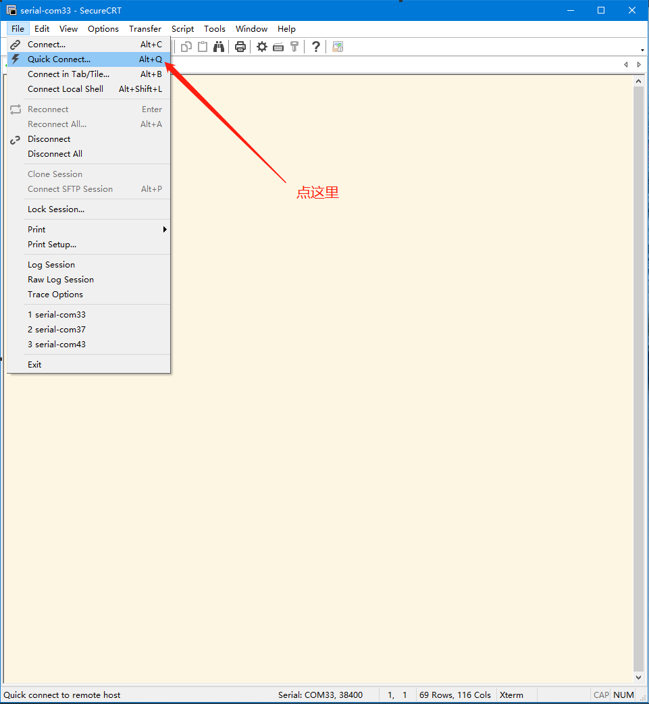
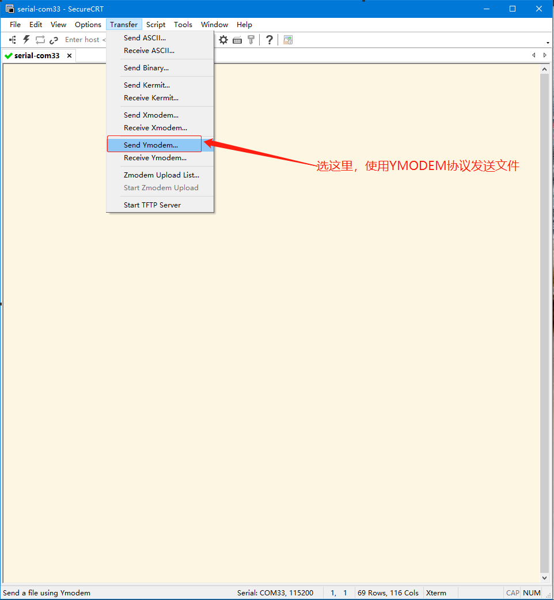
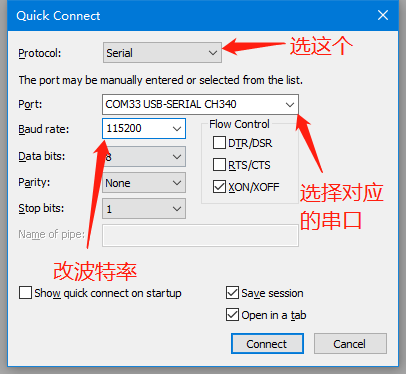
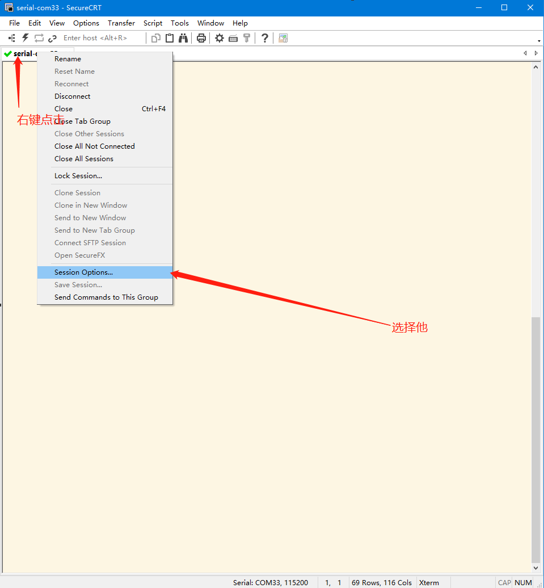
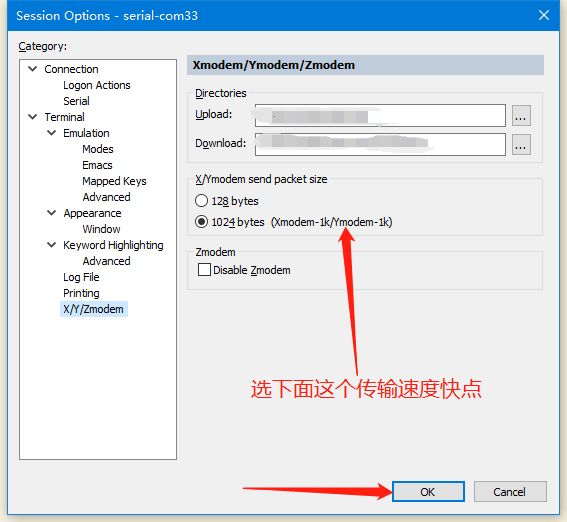
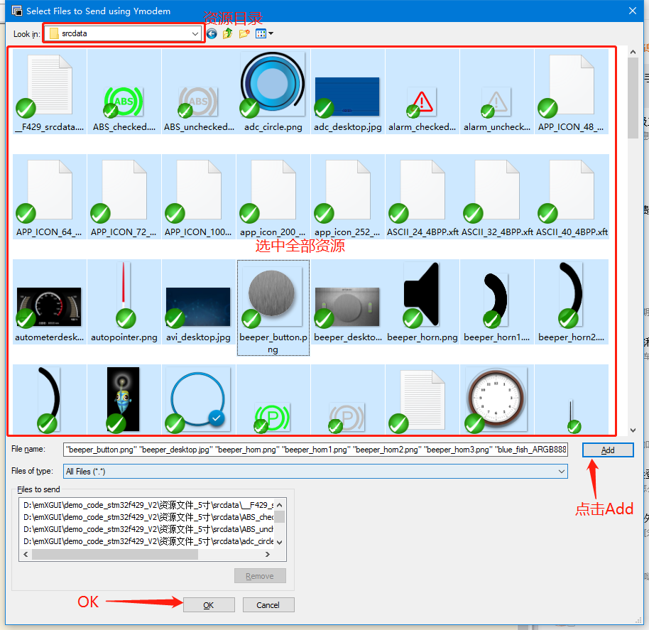

# 本项目使用教程

## 上位机-SecureCRT

请自行百度下载并安装该软件。

## 跑代码

- 把**1-刷外部FLASH程序（烧录emXGUI资源文件）-串口YMODEM**的代码下载到开发板；
- 复位开发板运行代码；
- 按KEY2此时LED2绿灯亮起（开始擦除FLASH）；
- 漫长的等待，等待LED2绿灯灭掉（擦除完成）；
- 按下KEY1,此时等上位机配置好就开始传输文件了；
- 开始配置上位机（跟着图片操作就OK）：

配置上位机1：

配置上位机2：

配置上位机3：

配置上位机4：

配置上位机5：

配置上位机6：

- 点完OK就又是漫长的等待了；
- 等待十几分钟；
- 最后一个文件传输完成；
- LED2绿灯灭了，最后一个文件100%就是成功了；
- 如果不是的话就要把上面的步骤重新来一次.....